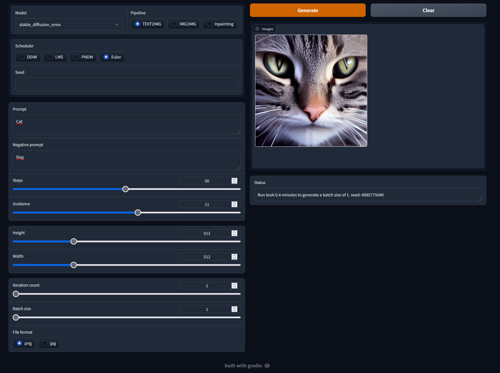
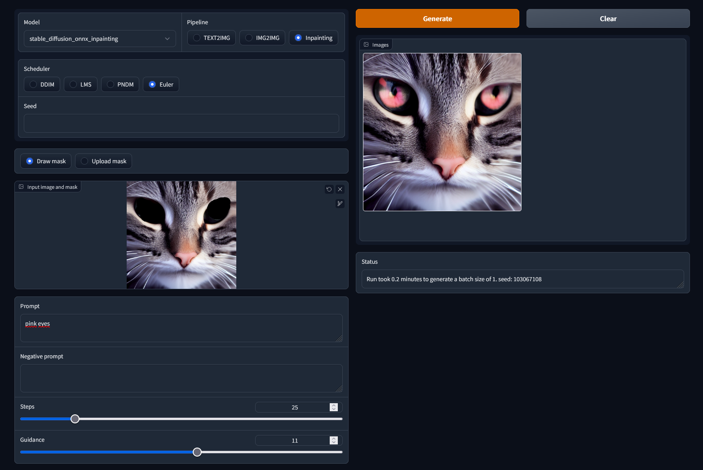

# Stable Diffusion ONNX UI

* [First installation](#first-installation)
* [How to add models](#how-to-add-models)
* [Run](#run)
* [Updating](#updating)

Dead simple gui with support for latest [Diffusers (v0.10.0)](https://github.com/huggingface/diffusers/) on Windows with AMD graphic cards (or CPU, thanks to ONNX and DirectML) with [Stable Diffusion 2.1](https://huggingface.co/stabilityai/stable-diffusion-2-1) or any other model, even inpainting finetuned ones.

Supported schedulers: DDIM, LMS, PNDM, Euler.

Built with Gradio.





## First installation

Prerequisites

* [Python 3.10](https://www.python.org/downloads/)
* [Git for windows](https://git-scm.com/download/win)
* An [huggingface.co](huggingface.co) account
* For a better experience, the [latest version of Powershell](https://github.com/PowerShell/PowerShell/releases)

From an empty folder:

```ps1
python -m venv venv
.\venv\Scripts\activate
python -m pip install --upgrade pip
pip install wheel wget
pip install git+https://github.com/huggingface/diffusers.git
pip install transformers onnxruntime onnx gradio torch ftfy spacy scipy OmegaConf accelerate
pip install onnxruntime-directml --force-reinstall
pip install protobuf==3.20.1
python -m wget https://raw.githubusercontent.com/JbPasquier/stable-diffusion-onnx-ui/main/app.py
python -m wget https://raw.githubusercontent.com/huggingface/diffusers/main/scripts/convert_original_stable_diffusion_to_diffusers.py -o convert_original_stable_diffusion_to_diffusers.py
python -m wget https://raw.githubusercontent.com/huggingface/diffusers/main/scripts/convert_stable_diffusion_checkpoint_to_onnx.py -o convert_stable_diffusion_checkpoint_to_onnx.py
python -m wget https://raw.githubusercontent.com/runwayml/stable-diffusion/main/configs/stable-diffusion/v1-inference.yaml -o v1-inference.yaml
python -m wget https://raw.githubusercontent.com/runwayml/stable-diffusion/main/configs/stable-diffusion/v1-inpainting-inference.yaml -o v1-inpainting-inference.yaml
mkdir model
```

## How to add models

### Stable Diffusion

```ps1
python convert_stable_diffusion_checkpoint_to_onnx.py --model_path="stabilityai/stable-diffusion-2-1" --output_path="model/stable_diffusion_onnx"
```

### Stable Diffusion Inpainting

```ps1
python convert_stable_diffusion_checkpoint_to_onnx.py --model_path="stabilityai/stable-diffusion-2-inpainting" --output_path="model/stable_diffusion_inpainting_onnx"
```

### Other from Hugging Face

```ps1
python convert_stable_diffusion_checkpoint_to_onnx.py --model_path="nitrosocke/Nitro-Diffusion" --output_path="model/nitro_diffusion_onnx"
```

### Other from somewhere else

Replace `some_file.ckpt` with the path to your ckpt one.

```ps1
python convert_original_stable_diffusion_to_diffusers.py --checkpoint_path="./some_file.ckpt" --dump_path="./some_file"
python convert_stable_diffusion_checkpoint_to_onnx.py --model_path="./some_file" --output_path="model/some_onnx"
```

## Run

```ps1
# Ensure that you are in the virtualenv
.\venv\Scripts\activate

# Your computer only
python app.py

# Local network
python app.py --local

# The whole internet
python app.py --share

# Use CPU instead of AMD GPU
python app.py --cpu-only
```

Notice that inpainting provide way better results with a proper model like [stable-diffusion-inpainting](https://huggingface.co/stabilityai/stable-diffusion-2-inpainting)

## Updating

Remove `venv` folder and `*.py` files and restart the [First installation](#first-installation) process.

## Credits

Inspired by:

* [azuritecoin/OnnxDiffusersUI](https://github.com/azuritecoin/OnnxDiffusersUI)
* [averad/256c507baa3dcc9464203dc14610d674](https://gist.github.com/averad/256c507baa3dcc9464203dc14610d674)
